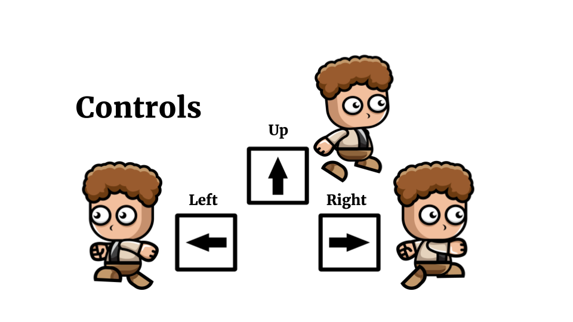
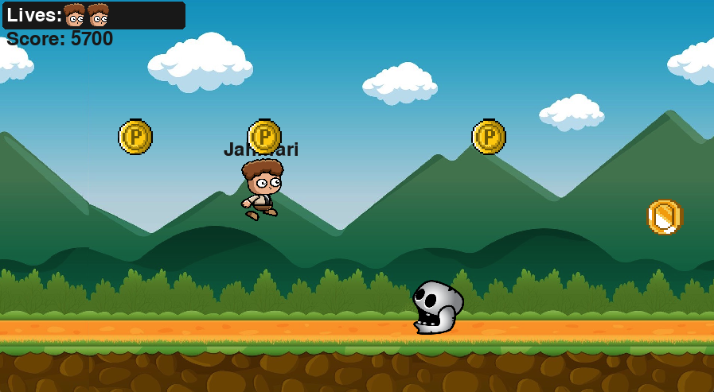

# 🏃‍♂️ The Running Game

**The Running Game** is a 2D side-scrolling action game built using Python and Pygame. Navigate treacherous terrain, collect coins, dodge obstacles, and avoid skull enemies all while keeping your lives intact and your score soaring!

---

## 🧠 Features

- 🎨 **Animated Player Character** with running, jumping, and idle states
- 🪙 **Collectible Coins and Super Coins** to earn points
- 💀 **Skull Enemies** that take away lives on collision
- 🪨 **Obstacles** to dodge
- 🔊 **Sound Effects & Background Music**
- 🎮 **Keyboard Controls** for fluid movement
- 📈 **Score System** that increases over time and with coins
- 💔 **Lives System** and respawning mechanism
- 🖥️ **Start, Controls, Game Over, and Thanks Screens**

---

## 📸 Screenshots

### Title Screen

### Controls

### Running Action

---

## 🧰 Installation

### Download Version 1.0 (For Mac Only):
 - [Download `Running Game.zip`](https://drive.google.com/file/d/1Qzym1NTBll5FZClSGWCehICZ-Urb71Ah/view?usp=drive_link)

 - **Extract the ZIP file** to your desired folder.